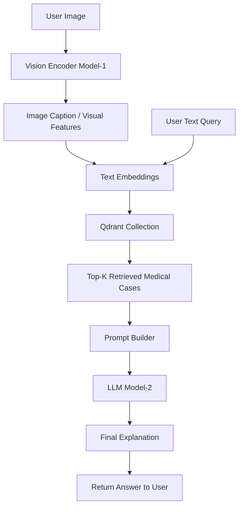

<div align="center">
    <a href="https://www.mirea.ru">
      
    </a>
    <h1>Diploma</h1>
    <p><i>ИПТИП, Fullstack-разработка, ЭФБО-04-22</i></p>
    <p>
        <a href="https://t.me/Papajunn" target="_blank">Матвей Вишняков</a>
    </p>
</div>

# Diploma

## 1 Клонирование репозитория и настройка VSCode

Для начала требуется склонировать репозиторий и открыть его.

```bash
# Клонирование репозитория с использованием SSH ключа
git clone git@github.com:Tr0ubad0ur/multimodal-rag-gpt.git

# Открытие проекта в VSCode
code multimodal-rag-gpt
```

Теперь требуется установить рекомендуемые расширения VSCode из файла [`.vscode/extensions.json`] (при открытии проекта появится всплывающее окно).

Далее требуется сделать новую ветку, либо использовать существующую согласно GitFlow процессу работы.

## 2 Создание виртуального окружения

```bash
# Установка менеджера пакетов UV
curl -LsSf https://astral.sh/uv/install.sh | sh
# powershell -ExecutionPolicy ByPass -c "irm https://astral.sh/uv/install.ps1 | iex" на Windows
```

```bash
# Создание виртуальной среды
uv venv

# Активация виртуальной среды
. .venv/bin/activate
# .venv\Scripts\activate на Windows
```

> [!note] Глоссарий
> *pre-commit хуки* — это скрипты, которые автоматически запускаются перед коммитом и проверяют/исправляют код (линтеры, форматирование и т.п.), чтобы в репозиторий попадал только корректный код.

```bash
# Установка pre-commit хуков
uv run pre-commit install
```

```bash
# Установка зависимостей
uv sync
```

## 3. Запуск backend через Docker

### 3.0 Одна команда (web + worker + qdrant + monitoring)

```bash
docker compose -f docker-compose.local.yml up -d --build
```

Проверка:

```bash
curl -s http://localhost:8000/health/ready | jq .
curl -s http://localhost:8010/health/ready | jq .
```

Остановка:

```bash
docker compose -f docker-compose.local.yml down
```

### 3.0.1 GPU/Linux профиль через `uv`

Для короткого прогона на Linux-сервере с NVIDIA GPU подготовлен отдельный профиль:

```bash
cp .env.gpu.example .env.gpu
# заполнить секреты и URL

docker compose -f docker-compose.gpu.yml build
docker compose -f docker-compose.gpu.yml up -d
```

Проверка:

```bash
curl -s http://localhost:18000/health/ready | jq .
curl -s http://localhost:18010/health/ready | jq .
```

Предварительная проверка среды и модели:

```bash
uv sync
uv run python scripts/check_gpu_env.py
uv run python scripts/check_model_gpu.py --model Qwen/Qwen2.5-VL-7B-Instruct
```

Полный порядок действий вынесен в [RUNBOOK_GPU.md](RUNBOOK_GPU.md).

```bash
# 1) Поднять Qdrant
docker compose -f docker-compose.qdrant.yml up -d

# 2) Собрать образ backend
docker build -t multimodal-rag-gpt:local .

# 3) Запустить web API
docker run --rm --name rag-web \
  -p 8000:8000 \
  --env-file .env \
  -e INGEST_POLLER_ENABLED=false \
  -v "$(pwd)/data/uploads:/app/data/uploads" \
  multimodal-rag-gpt:local

# 4) В отдельном терминале запустить worker API (health/readiness + jobs)
docker run --rm --name rag-worker \
  -p 8010:8010 \
  --env-file .env \
  -e APP_MODE=worker \
  -e INGEST_POLLER_ENABLED=false \
  -e INGEST_WORKER_MAX_CONCURRENCY=4 \
  -v "$(pwd)/data/uploads:/app/data/uploads" \
  multimodal-rag-gpt:local \
  uvicorn backend.worker_app:app --host 0.0.0.0 --port 8010
```

Полезные env-переменные:
- `ADMIN_API_KEY` (обязательно для `X-Admin-Key` на admin API)
- `ADMIN_RATE_LIMIT_PER_MINUTE` (опционально)
- `REDIS_URL` (опционально, fallback для distributed rate limit)

### Production env checklist (web + worker)

Обязательные переменные:

- `SUPABASE_URL`
- `SUPABASE_ANON_KEY`
- `SUPABASE_SERVICE_ROLE_KEY`
- `QDRANT_URL`

Для `web` дополнительно:

- `ADMIN_API_KEY`
- `INGEST_POLLER_ENABLED=false` (встроенный poller в web отключен)
- `ADMIN_RATE_LIMIT_PER_MINUTE` (целое число `>=1`)
- `ASK_RATE_LIMIT_PER_MINUTE_AUTH` (опционально, по умолчанию `120`)
- `ASK_RATE_LIMIT_PER_MINUTE_GUEST` (опционально, по умолчанию `40`)
- `UPLOAD_RATE_LIMIT_PER_MINUTE_AUTH` (опционально, по умолчанию `60`)
- `UPLOAD_RATE_LIMIT_PER_MINUTE_GUEST` (опционально, по умолчанию `20`)
- `MAX_FILES_PER_USER` (опционально, по умолчанию `2000`)
- `MAX_STORAGE_BYTES_PER_USER` (опционально, по умолчанию `10737418240`)
- `MAX_FILES_PER_FOLDER_UPLOAD` (опционально, по умолчанию `100`)
- `MAX_UPLOAD_SIZE_BYTES` (опционально, по умолчанию `52428800`)

Для `worker` дополнительно:

- `INGEST_WORKER_MAX_CONCURRENCY` (целое число `>=1`)

Опционально:

- `REDIS_URL` (если задан, должен начинаться с `redis://` или `rediss://`)

Проверка:

- `GET /health/ready` для web
- `GET /health/ready` на worker (например, `:8010/health/ready`)

## 3.1 Локальный Supabase (Auth + Postgres)

Локальный запуск Supabase удобен для авторизации и разделения данных пользователей.

```bash
# Установка Supabase CLI (если нет)
brew install supabase/tap/supabase

# Инициализация и старт локального Supabase
supabase init
supabase start
```

После старта Supabase CLI покажет:
`SUPABASE_URL`, `SUPABASE_ANON_KEY`, `SUPABASE_SERVICE_ROLE_KEY`.
Их можно положить в `.env` и использовать в backend.

```bash
# Применить миграции (создаст таблицу query_history)
supabase db reset
```

## 3.2 Auth API (Supabase)

```bash
# Signup
curl -X POST "http://localhost:8000/auth/signup" \
  -H "Content-Type: application/json" \
  -d '{"email":"user@example.com","password":"secret123"}'

# Signin
curl -X POST "http://localhost:8000/auth/signin" \
  -H "Content-Type: application/json" \
  -d '{"email":"user@example.com","password":"secret123"}'

# Refresh token
curl -X POST "http://localhost:8000/auth/refresh" \
  -H "Content-Type: application/json" \
  -d '{"refresh_token":"<REFRESH_TOKEN>"}'

# Logout (нужен access token)
curl -X POST "http://localhost:8000/auth/logout" \
  -H "Authorization: Bearer <ACCESS_TOKEN>" \
  -H "Content-Type: application/json" \
  -d '{"scope":"global"}'
```

Из ответа `signin` возьми `access_token` и используй для авторизованных запросов:

```bash
# Запрос с авторизацией
curl -X POST "http://localhost:8000/ask_auth" \
  -H "Content-Type: application/json" \
  -H "Authorization: Bearer <ACCESS_TOKEN>" \
  -d '{"query":"О чем документ?","top_k":3}'

# История запросов пользователя
curl -X GET "http://localhost:8000/history" \
  -H "Authorization: Bearer <ACCESS_TOKEN>"

# Удалить запись истории по id
curl -X DELETE "http://localhost:8000/history/<ID>" \
  -H "Authorization: Bearer <ACCESS_TOKEN>"
```

## 3.3 Разделение данных Qdrant по пользователям

Если нужно хранить разные данные для разных пользователей, добавляй `user_id`
в payload при индексации.

В запросах `POST /ask_auth` поиск идет с фильтром по `user_id`.

## 3.4 Embeddings и метрики

```bash
# text embeddings
curl -X POST "http://localhost:8000/embed/text" \
  -H "Content-Type: application/json" \
  -d '{"text":"Пример текста"}'

# image embeddings (локальный путь к файлу)
curl -X POST "http://localhost:8000/embed/image" \
  -H "Content-Type: application/json" \
  -d '{"image_path":"data/test_data/sample.jpg"}'

# video embeddings (локальный путь к файлу)
curl -X POST "http://localhost:8000/embed/video" \
  -H "Content-Type: application/json" \
  -d '{"video_path":"data/test_data/sample.mp4","sample_fps":1.0}'

# Prometheus scrape endpoint
curl "http://localhost:8000/metrics"
```

## 3.5 Prometheus + Grafana

```bash
# Запуск мониторинга локально через Docker
docker compose -f docker-compose.monitoring.yml up -d
```

В Grafana автоматически подключается datasource Prometheus и дашборд
`Multimodal RAG Overview`.

## 3.6 Выбор embedding-модели

Провайдеры и модели задаются в [backend/backend_config.yaml](backend/backend_config.yaml):

```yaml
embeddings:
  default_provider: "sentence-transformers-default"
  providers:
    sentence-transformers-default:
      type: "sentence-transformers"
      text_model_name: "all-MiniLM-L6-v2"
      image_model_name: "clip-ViT-B-32"
    sentence-transformers-multilingual:
      type: "sentence-transformers"
      text_model_name: "paraphrase-multilingual-MiniLM-L12-v2"
      image_model_name: "clip-ViT-B-32"
```

Также можно выбрать провайдер на запросе:

```bash
curl -X POST "http://localhost:8000/embed/text" \
  -H "Content-Type: application/json" \
  -d '{"text":"Пример","provider":"sentence-transformers-multilingual"}'
```

## 3.7 Автотесты

```bash
# unit + integration
pytest -q

# только unit
pytest -q tests/unit

# только integration
pytest -q tests/integration
```

## 3.8 Consistency операции (reindex + cleanup)

```bash
# Переиндексация одного файла пользователя
curl -X POST "http://localhost:8000/files/<FILE_ID>/reindex" \
  -H "Authorization: Bearer <ACCESS_TOKEN>"

# Admin: массовая переиндексация (все или только missing vectors)
curl -X POST "http://localhost:8000/admin/consistency/reindex?limit=200&only_missing_vectors=true" \
  -H "X-Admin-Key: <ADMIN_API_KEY>"

# Admin: dry-run cleanup (orphan uploads/vectors и missing storage records)
curl -X POST "http://localhost:8000/admin/consistency/cleanup?dry_run=true" \
  -H "X-Admin-Key: <ADMIN_API_KEY>"

# Admin: реальный cleanup
curl -X POST "http://localhost:8000/admin/consistency/cleanup?dry_run=false" \
  -H "X-Admin-Key: <ADMIN_API_KEY>"
```

## 3.9 Нагрузочное тестирование (baseline)

```bash
# ASK нагрузка (guest или auth при передаче --token)
python scripts/load_test_ask.py \
  --base-url http://localhost:8000 \
  --endpoint /ask_auth \
  --token "<ACCESS_TOKEN>" \
  --requests 500 \
  --concurrency 50

# Upload нагрузка для auth
BASE_URL=http://localhost:8000 \
TOKEN="<ACCESS_TOKEN>" \
FILE_PATH="data/test_data/sample.txt" \
REQUESTS=200 \
PARALLEL=20 \
bash scripts/load_test_upload.sh
```

Сценарии для production проверки:

- пиковые burst-запросы на `/ask_auth`;
- параллельные upload в `/files/upload` и `/kb/folders/upload`;
- рестарт worker-процесса под нагрузкой (проверка, что jobs не теряются и подбираются заново);
- recovery после partial failures (ошибки Qdrant/Supabase, рост retry и DLQ).

## 4. Структура проекта

```bash
project-root/
│
├── backend/
│   ├── main.py
│   ├── api/
│   │   └── endpoints.py
│   ├── core/
│   │   ├── embeddings.py
│   │   ├── image_embeddings.py
│   │   ├── llm.py
│   │   ├── vectordb.py
│   │   └── multimodal_rag.py
│   └── utils/
│       ├── loaders.py
│       └── config.py
│
├── data/
│   ├── ...
├── docs/
│   ├── en
│   └── ru
├── notebooks
│   └── workflow.ipynb
├── .env
├── .gitignore
├── .pre-commit-config
├── .python-version
├── mkdocks.yml
├── pyproject.toml
├── README.md
└── uv.lock

```

## 5. Multimodal RAG Pipeline for Medical Imaging


