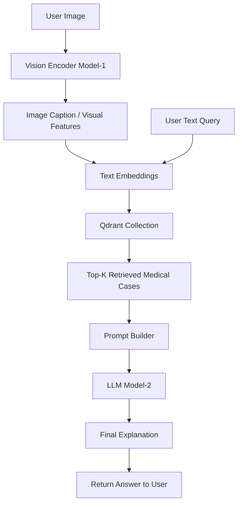

<div align="center">
    <a href="https://www.mirea.ru">
      
    </a>
    <h1>Diploma</h1>
    <p><i>ИПТИП, Fullstack-разработка, ЭФБО-04-22</i></p>
    <p>
        <a href="https://t.me/Papajunn" target="_blank">Матвей Вишняков</a>
    </p>
</div>

# Diploma

## 1 Клонирование репозитория и настройка VSCode

Для начала требуется склонировать репозиторий и открыть его.

```bash
# Клонирование репозитория с использованием SSH ключа
git clone git@github.com:Tr0ubad0ur/multimodal-rag-gpt.git

# Открытие проекта в VSCode
code multimodal-rag-gpt
```

Теперь требуется установить рекомендуемые расширения VSCode из файла [`.vscode/extensions.json`] (при открытии проекта появится всплывающее окно).

Далее требуется сделать новую ветку, либо использовать существующую согласно GitFlow процессу работы.

## 2 Создание виртуального окружения

```bash
# Установка менеджера пакетов UV
curl -LsSf https://astral.sh/uv/install.sh | sh
# powershell -ExecutionPolicy ByPass -c "irm https://astral.sh/uv/install.ps1 | iex" на Windows
```

```bash
# Создание виртуальной среды
uv venv

# Активация виртуальной среды
. .venv/bin/activate
# .venv\Scripts\activate на Windows
```

> [!note] Глоссарий
> *pre-commit хуки* — это скрипты, которые автоматически запускаются перед коммитом и проверяют/исправляют код (линтеры, форматирование и т.п.), чтобы в репозиторий попадал только корректный код.

```bash
# Установка pre-commit хуков
uv run pre-commit install
```

```bash
# Установка зависимостей
uv sync
```

## 3. Запусти векторную базу Qdrant

```bash
# Быстрый запуск
docker run -p 6333:6333 qdrant/qdrant

# Рекомендуемый запуск с сохранением данных (один раз загрузи тестовые данные)
docker compose -f docker-compose.qdrant.yml up -d
python scripts/ingest_qdrant.py
# Для изображений
EMBED_TYPE=image python scripts/ingest_qdrant.py
# Для видео
EMBED_TYPE=video python scripts/ingest_qdrant.py

# Запуск ручки swagger на FastAPI
uvicorn backend.main:app --reload

# Отдельный воркер очереди индексации (рекомендуется в prod)
INGEST_POLLER_ENABLED=false uvicorn backend.main:app --reload
uv run ingest-worker
# (опционально) лимит параллельной обработки задач воркером
INGEST_WORKER_MAX_CONCURRENCY=4 uv run ingest-worker
# (опционально) лимит admin-ручек в минуту
ADMIN_RATE_LIMIT_PER_MINUTE=60
# (опционально) Redis fallback для distributed rate limit, если DB RPC недоступен
REDIS_URL=redis://localhost:6379/0
# (обязательно для admin API) ключ для X-Admin-Key
ADMIN_API_KEY=change-me
```

> [!note]
> Qdrant хранит данные в volume `qdrant_storage`. После первой загрузки
> `python scripts/ingest_qdrant.py` повторять не нужно — данные сохраняются.

## 3.1 Локальный Supabase (Auth + Postgres)

Локальный запуск Supabase удобен для авторизации и разделения данных пользователей.

```bash
# Установка Supabase CLI (если нет)
brew install supabase/tap/supabase

# Инициализация и старт локального Supabase
supabase init
supabase start
```

После старта Supabase CLI покажет:
`SUPABASE_URL`, `SUPABASE_ANON_KEY`, `SUPABASE_SERVICE_ROLE_KEY`.
Их можно положить в `.env` и использовать в backend.

```bash
# Применить миграции (создаст таблицу query_history)
supabase db reset
```

## 3.2 Auth API (Supabase)

```bash
# Signup
curl -X POST "http://localhost:8000/auth/signup" \
  -H "Content-Type: application/json" \
  -d '{"email":"user@example.com","password":"secret123"}'

# Signin
curl -X POST "http://localhost:8000/auth/signin" \
  -H "Content-Type: application/json" \
  -d '{"email":"user@example.com","password":"secret123"}'

# Refresh token
curl -X POST "http://localhost:8000/auth/refresh" \
  -H "Content-Type: application/json" \
  -d '{"refresh_token":"<REFRESH_TOKEN>"}'

# Logout (нужен access token)
curl -X POST "http://localhost:8000/auth/logout" \
  -H "Authorization: Bearer <ACCESS_TOKEN>" \
  -H "Content-Type: application/json" \
  -d '{"scope":"global"}'
```

Из ответа `signin` возьми `access_token` и используй для авторизованных запросов:

```bash
# Запрос с авторизацией
curl -X POST "http://localhost:8000/ask_auth" \
  -H "Content-Type: application/json" \
  -H "Authorization: Bearer <ACCESS_TOKEN>" \
  -d '{"query":"О чем документ?","top_k":3}'

# История запросов пользователя
curl -X GET "http://localhost:8000/history" \
  -H "Authorization: Bearer <ACCESS_TOKEN>"

# Удалить запись истории по id
curl -X DELETE "http://localhost:8000/history/<ID>" \
  -H "Authorization: Bearer <ACCESS_TOKEN>"
```

## 3.3 Разделение данных Qdrant по пользователям

Если нужно хранить разные данные для разных пользователей, добавляй `user_id`
в payload при индексации. Для тестовых данных можно задать переменную окружения:

```bash
USER_ID="<SUPABASE_USER_ID>" python scripts/ingest_qdrant.py
```

В запросах `POST /ask_auth` поиск идет с фильтром по `user_id`.

## 3.4 Embeddings и метрики

```bash
# text embeddings
curl -X POST "http://localhost:8000/embed/text" \
  -H "Content-Type: application/json" \
  -d '{"text":"Пример текста"}'

# image embeddings (локальный путь к файлу)
curl -X POST "http://localhost:8000/embed/image" \
  -H "Content-Type: application/json" \
  -d '{"image_path":"data/test_data/sample.jpg"}'

# video embeddings (локальный путь к файлу)
curl -X POST "http://localhost:8000/embed/video" \
  -H "Content-Type: application/json" \
  -d '{"video_path":"data/test_data/sample.mp4","sample_fps":1.0}'

# Prometheus scrape endpoint
curl "http://localhost:8000/metrics"
```

## 3.5 Prometheus + Grafana

```bash
# backend должен быть запущен локально на :8000
docker compose -f docker-compose.monitoring.yml up -d

# UI
# Prometheus: http://localhost:9090
# Grafana: http://localhost:3000 (admin/admin)
```

В Grafana автоматически подключается datasource Prometheus и дашборд
`Multimodal RAG Overview`.

## 3.6 Выбор embedding-модели

Провайдеры и модели задаются в [backend/backend_config.yaml](backend/backend_config.yaml):

```yaml
embeddings:
  default_provider: "sentence-transformers-default"
  providers:
    sentence-transformers-default:
      type: "sentence-transformers"
      text_model_name: "all-MiniLM-L6-v2"
      image_model_name: "clip-ViT-B-32"
    sentence-transformers-multilingual:
      type: "sentence-transformers"
      text_model_name: "paraphrase-multilingual-MiniLM-L12-v2"
      image_model_name: "clip-ViT-B-32"
```

Также можно выбрать провайдер на запросе:

```bash
curl -X POST "http://localhost:8000/embed/text" \
  -H "Content-Type: application/json" \
  -d '{"text":"Пример","provider":"sentence-transformers-multilingual"}'
```

## 3.7 Автотесты

```bash
# unit + integration
pytest -q

# только unit
pytest -q tests/unit

# только integration
pytest -q tests/integration
```

## 4. Структура проекта

```bash
project-root/
│
├── backend/
│   ├── main.py
│   ├── api/
│   │   └── endpoints.py
│   ├── core/
│   │   ├── embeddings.py
│   │   ├── image_embeddings.py
│   │   ├── llm.py
│   │   ├── vectordb.py
│   │   └── multimodal_rag.py
│   └── utils/
│       ├── loaders.py
│       └── config.py
│
├── data/
│   ├── ...
├── docs/
│   ├── en
│   └── ru
├── frontend
│   ├── ...
├── notebooks
│   └── workflow.ipynb
├── .env
├── .gitignore
├── .pre-commit-config
├── .python-version
├── mkdocks.yml
├── pyproject.toml
├── README.md
└── uv.lock

```

## 5. Multimodal RAG Pipeline for Medical Imaging


